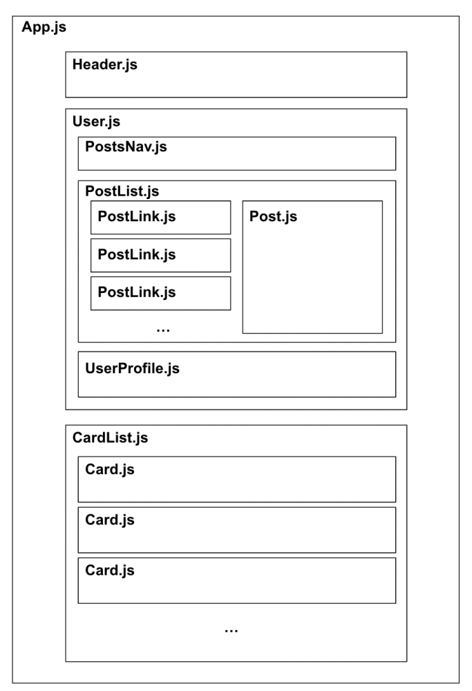

# Community-blog

## Function
A community blog admin account that shows multiple users. By clicking on each user you are taken to their profile page where you can further see all their posts and even delete posts.

## Installation
1. Fork this repository by clicking the Fork button at the top right of the page.
2. Clone this repository.
3. cd into the newly created directory.
4. Run npm install.
5. Run npm start.
Running npm start will spin up a server on port 5000

## Visual Hierarchy of react components

